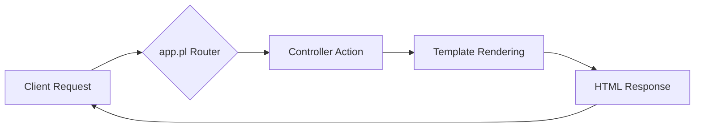

# Perl Modern Web Layout

This project is a simple Perl web application that serves a modern canonical webpage layout. It is built using the Mojolicious framework. This application demonstrates a modern approach to handling long-running requests by using Mojo's non-blocking I/O and Server-Sent Events (SSE) to stream content to the client, preventing the page from hanging.

## Tech Stack Overview: Perl & Mojolicious

For those unfamiliar with the backend stack, this application is built with [Perl](https://www.perl.org/) and the [Mojolicious](https://mojolicious.org) real-time web framework. Mojolicious provides a powerful and scalable foundation for web development, following a Model-View-Controller (MVC) architecture. This separation of concerns makes the codebase organized and easier to maintain.

You'll primarily interact with a few key parts of the framework:
- **`app.pl`**: The main entry point for the application, where routes are defined to map incoming requests to the correct controller logic.
- **Controllers** (`lib/Controller/*.pm`): These are Perl modules that handle the core application logic for each request.
- **Templates** (`templates/*.ep`): These are "Embedded Perl" files used to generate the HTML content that is sent back to the user's browser.
- **`Mojo::IOLoop`**: The powerful non-blocking event loop used for asynchronous operations. You can see it in action in `test/server.pl` to handle many connections at once without blocking.

The basic request flow can be visualized as follows:



This structure helps keep the application logic well-organized. For a deeper dive into what Mojolicious can do, the official documentation and tutorials at [mojolicious.org](https://mojolicious.org/documentation) are excellent resources.

## Prerequisites

Before you begin, you will need to have Perl installed. You can download it from [perl.org](https://www.perl.org/get.html).

You will also need `cpanm`, which is a command-line tool to manage and install Perl modules. You can typically install it by running the following command in your terminal:

```sh
cpan App::cpanminus
```

## Installation

1. **Clone the repository or download the files.**

2. **Navigate to the project directory** in your terminal.

3. **Install the required Perl modules** using `Carton`:

    This command tells `cpanm` to look for the `cpanfile` in the current directory, resolve dependencies, and install them into a `local` directory.

    ```sh
    carton install
    ```

    You may see a lot of output as the modules are downloaded, tested, and installed.

## Running the Application

Once the dependencies are installed, you can start the web server with the following command. We use Mojolicious's built-in web server.

```sh
carton exec morbo app.pl
```

`morbo` is a development web server that automatically reloads the application when files change. For production, you would use the `daemon` command.

You should see a message indicating that the server is running.

## Accessing the Site

Open your web browser and navigate to the following URL:

[http://localhost:3000](http://localhost:3000)

You should see the modern layout page with navigation tabs and a table of data. The table rows will stream in one by one via Server-Sent Events, demonstrating the non-blocking nature of the application. To stop the server, go back to your terminal and press `Ctrl+C`.
